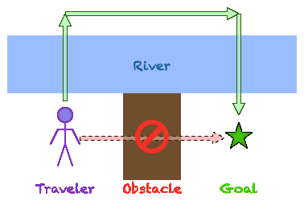

# recursion-by-refactoring

_A step-by-step approach to recursion by refactoring from obvious but limited code to a clean recursive version._

I have long believed that the most "complicated" thing about recursion is the explanations offered when it is taught poorly. This represents my attempt to help in that regard. The project takes a couple of basic tasks and incrementally refactors their solutions into recursive form, attempting to make each step as painless as possible.

The project uses Node.js because it is widely used and readily available. No value judgment is expressed or implied about the merits or demerits of JavaScript versus any other language.

## Status

This is a work in process; the next step after initial set up will be documentation of the problems being addressed, the strategies for refactoring, and the thought patterns that are applied.

## Title

Yes, the title is dry and boring. I thought about calling it "Recursing without cursing", but am still kicking around alternatives. I am not in marketing.

## Patterns and Idioms

I have found re-usable patterns and principles to be very helpful in thinking through design, problem-solving, and defect resolution tasks. Below is an informal list of such practices that I will apply throughout this project.

### Use structures to manage data and code

Let's start with two of the basic structures, one for data and one for code.

* Use an array to hold a sequence or collection of values, to avoid the costs of:
	* keeping up with individual variable names and their relationships, and
	* ensuring consistent literal values, where each occurrence represents an opportunity for typographic errors.
* Use a function to represent a collection of activity, to avoid the costs of:
	* writing the same code over and over,
	* having to make future changes multiple times (consistently!), and
	* requiring the reader to wade through the details in-line in order to understand intent.

Both of these are techniques for consciously organizing (and naming) parts of what we're building. They are so familiar that I won't belabor their description or benefits further here.

### Double-crossing and obstacle

An obstacle lies between you and your goal. This is bad. Sometimes the quickest solution is to _double-cross_ the obstacle, as illustrated below.



You're walking along the bank of the river toward the goal, and an obstacle comes into view. Maybe it's a steep gully, or quicksand, or a briar patch, or a moat filled with sharks with laser beams strapped to their heads. But the opposite bank of the river offers smooth, easy walking. So...

* Cross to the opposite bank;
* Walk on that side until near the goal; and then
* Cross back to the original side to reach the goal.

That's why I called it a "double-cross". But what does that look like in practice?

#### Double-crossing a ducting problem

When we replaced the old hood vent over our kitchen stove with a microwave oven, I found that the vent opening in the top of the microwave was a different size and shape than the ducting through the supporting upper cabinet. I needed to fabricate a sheet metal duct that connected two rectangular shapes that weren't even aligned. The space was tight, and I didn't like the risk of wasting material by making bad cuts (or of leaving parts of my fingers behind), so I _double-crossed_ the problem.

I took measurements, then performed my design experiments by cutting and taping cardboard pieces until I had an entire structure that I could build outside the cabinet and slide into place. Then I used the cardboard sections as templates to cut the sheet metal parts, which I then assembled and installed.

So, in this case, the two river banks were the two materials, each of which was better suited for part of the overall task.

#### Double-crossing a sorting problems

How does one sort an array of objects based on a key that must be extracted from each object's content? For example, if we have an array of family tree entries something like this:

```javascript
[
	{
		name: 'John Doe',
		birthdate: '1974-08-12',
		occupation: 'genius',
		...
	},
	...
]
```

and want to sort them e.g. by last name, then birthdate, then first name, (with the name parts compared in case-insensitive fashion) we could certainly define a ```getKey()``` function which is called on each comparison. But it would waste time to call the function on the same entry whenever it is compared with another entry. Enter the [Schwartzian transform](https://en.wikipedia.org/wiki/Schwartzian_transform), part of the [Perl language folklore](https://www.perl.com/article/the-history-of-the-schwartzian-transform/).

First, map the array to an array of new entries decorated with the key for each (computed only once).

```javascript
[
	['DOE:1974-08-12:JOHN',{
		name: 'John Doe',
		birthdate: '1974-08-12',
		occupation: 'genius',
		...
	}],
	...
]
```

Then sort the resulting array by the pre-computed keys, and finally map the new structures back by ripping off the keys and retaining only the original content.

In this case, crossing the river means moving from a representation that requires repeated key extraction to one that prepares the keys (once per entry), and re-crossing the river is removing the keys after they are no longer needed.

## More to come

Stay tuned for the next update to these notes!
